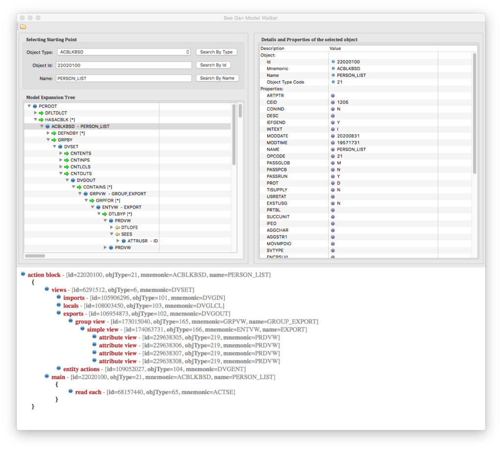
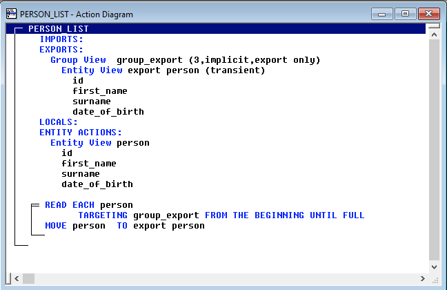

# Bee Gen Model Walker

Overview
========

This is a research utility allowing connect to the Bee Gen Model and navigate thru the model.

The CA Gen models are complicated and extensive. There are thousands of types of objects, properties, and associations. Even the medium size model can have hundreds of thousands or millions of objects. The Bee Gen Models inherit the entire complexity and size.

Skills on navigating the vast population of objects and understanding the complexity of the associations between them are essential before any attempt to reuse such information by, for example, developing reports or writing generators or any similar projects.
Walker is a tool helping in the process.

More about this particular project you can find [here](http://www.jgen.eu/?p=900&preview=true).

> The Bee Gen Model Framework is still under
> development and subject to changes.
> 

Versions of used Software
=========================

- [SQLite Release 3.33.0 On 2020-08-14](https://sqlite.org/index.html)

- [sqlite-jdbc-3.32.3.2](https://github.com/xerial/sqlite-jdbc/releases)

- [Java SE 8 1.8.0_05](https://www.oracle.com/java/technologies/javase-jre8-downloads.html)

- [Eclipse Version: 2020-06 (4.16.0)](https://www.eclipse.org/downloads/)

Example of use
==============

Here is a snapshot of the screen of the Walker showing how the Walker does work. This example shows how the screen looks when you open a model and select object type or object id. You can see a hierarchical view of the fragment starting, in this case, from the PCROOT type of object. You can see that if you expand using forward association  HAACBLK, it returns several action blocks already defined in the model. You can expand further learning about the construction of the action block.

On the right side of the expansion tree, you can learn what properties have any of highlighted object.

On the pane below, you can see a special report showing the structure of the action block. This report maps objects to the action block's statements whenever you select an action block object in the expansion tree. There is only one type of report available at the current release, but more reports will be available in Walker's next releases.

The below snapshot shows a fragment of the model, as seen in the CA Gen Toolset, when developing an action block using an action block diagraming tool. 

